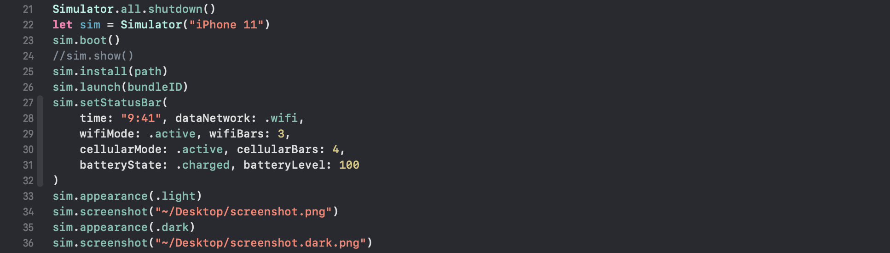

# SimulatorControl

Define simulator automations in Swift. SimulatorControl, built on simctl, is a SwiftPackage that lets you define procedural simulator actions, like taking screenshots.


Make screenshots easy.

## Getting Started

### 1. Create a new Target

Create a CLI tool for defining simulator automations.

`File > New > Target... > macOS > Command Line Tool`

This target will be executable through Xcode's run button, and it will be responsible for running the automations you define.

Configure the build scheme:

`MyTarget > Edit Scheme ... > Build > + > YourApp`

### 2. Add SimulatorControl to your Xcode project

`File > Swift Packages > Add Package Dependency...`

Use this project's URL. Add SimulatorControl as a dependency for your new CLI target.

### 3. Define an Automation

Start with this sample code to explore SimulatorControl's capabilities:

```swift
import SimulatorControl

var path = "/path/to/your/project.app"
var bundleID = "com.your.project"

let sim = Simulator("iPhone 11")
sim.boot()
sim.install(path)
sim.launch(bundleID)
sim.setStatusBar(
    time: "9:41", dataNetwork: .wifi,
    wifiMode: .active, wifiBars: 3,
    cellularMode: .active, cellularBars: 4,
    batteryState: .charged, batteryLevel: 100
)
sim.appearance(.light)
sim.screenshot("~/Desktop/screenshot.png")
sim.appearance(.dark)
sim.screenshot("~/Desktop/screenshot.dark.png")
```

If you want to automatically find the path to your .app file, use this snippet:

```swift
// current path is .../Build/Products/Debug
// we want to get to .../Build/Products/Debug-iphonesimulator/yourapp.app
var path = FileManager.default.currentDirectoryPath
path = "/" + path.split(separator: "/").dropLast().joined(separator: "/")
path += "/Debug-iphonesimulator/sample.app" // #TODO: switch to your app name
```
